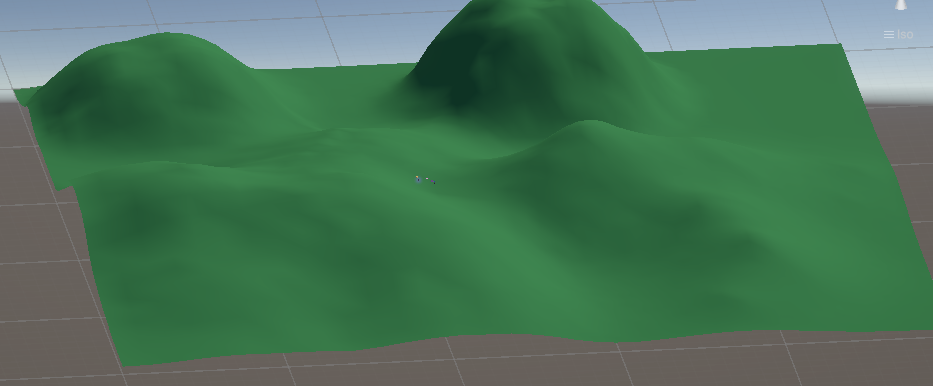

# Practica-01IS

## Incluir objetos 3D básicos
 Aqui simplemente he añadido unas formas basicas del editor de escenas, como 2 cylindros y 2 cubos, asi como una base, que e ajustado para que tenga una forma de plancha.
 
 

## Incluir  en el proyecto el paquete Starter Assets.
  Importamos al proyecto los asset **Starter Assets - ThirdPerson** y **Starter Assets - FirstPerson**, en mi caso e usado el de tercera persona.
  
 
 
## Incluir un objeto libre de la Asset Store que no sea de los Starter Assets.
  Añadi el asset **Hèroe robot** para añadir a un robot con su arma en el mapa
 
## Crear un terreno.
 Creo un terreno y le di algunas eleabciones para dar un efecto montañoso, luego importe una imagen verde para darle ese color o materialal terreno.

  

## Cada objeto debe tener una etiqueta que lo identifique
 Para cada uno de los elemntos que puse sobre el terreno cree un tag representativo

  

## Agregar un script que escriba en la consola la etiqueta y posición de cada objeto que hayas utilizado. 
  Pongo una captura del codigo realizado en la funcion **Star()** para que me muestre las posiciones de los elementos usadno **trasnform**.
  No hago nada con update ya que solo queiro qeu se muestre una vez, las posiciones inicilaes de los objetos.

  Codigo:
  
   

  Salida por consola:

   

  

